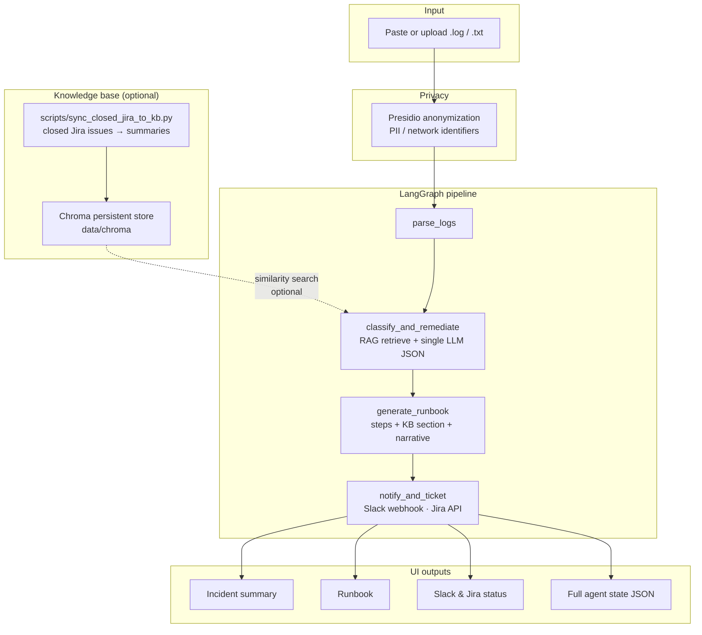

# Multi-Agent DevOps Incident Analysis Suite

A VS Code-ready GenAI project that uses **LangChain + LangGraph** to analyze DevOps logs and generate remediation guidance, runbooks, Slack notifications, and JIRA tickets.

## What This Project Demonstrates

- Multi-agent architecture
- LangGraph orchestration
- LangChain LLM usage
- DevOps/SRE log analysis
- Automated incident classification
- Remediation recommendation
- Runbook generation
- Optional Slack and JIRA integration
- Optional **RAG**: Chroma vector store + embeddings for past resolutions (from closed Jira sync script)
- **Single LLM call** for classification and remediation (fewer round trips than separate classify + plan steps)
- Gradio UI

## Agent Flow

End-to-end processing from raw logs to outputs (Presidio runs in the Gradio app **before** LangGraph). The knowledge base is optional: populate it with `scripts/sync_closed_jira_to_kb.py` so **`classify_and_remediate`** can run similarity search before the model call.

Flow summary:

1. **parse_logs** — Structure events from raw text.
2. **classify_and_remediate** — Keyword seed classification → **RAG** retrieve similar closed issues → **one** structured LLM response (incident fields + steps + remediation narrative using KB context).
3. **generate_runbook** — Markdown runbook from steps, optional LLM narrative, **and embedded RAG excerpts** (issue keys, summaries, snippets) for Slack/Jira and the UI.
4. **notify_and_ticket** — Slack webhook; Jira ticket for P1/P2 with the full runbook body.

Legacy helpers `classifier_agent.classify_incident` and `remediation_agent.recommend_remediation` remain in the repo for reuse but are **not** wired into the default graph.



## Project Structure

```text
devops-incident-suite/
├── agents/
│   ├── log_agent.py
│   ├── heuristics.py
│   ├── classify_remediate_agent.py
│   ├── classifier_agent.py
│   ├── remediation_agent.py
│   ├── runbook_agent.py
│   └── notification_agent.py
├── graph/
│   └── workflow.py
├── integrations/
│   ├── slack.py
│   └── jira.py
├── knowledge/
│   ├── vector_store.py
│   └── jira_kb_sync.py
├── scripts/
│   └── sync_closed_jira_to_kb.py
├── utils/
│   ├── llm.py
│   ├── embeddings.py
│   └── log_anonymization.py
├── tests/
├── data/sample_logs/
├── app.py
├── state.py
├── requirements.txt
├── .env.example
└── README.md
```

## Setup in VS Code on Windows

### 1. Open folder in VS Code

Open this repository folder (e.g. `devops-incident-suite`).

### 2. Create virtual environment

```powershell
py -m venv .venv
```

### 3. Activate virtual environment

```powershell
.\.venv\Scripts\Activate.ps1
```

If PowerShell blocks activation, run:

```powershell
Set-ExecutionPolicy -Scope CurrentUser RemoteSigned
```

Then activate again:

```powershell
.\.venv\Scripts\Activate.ps1
```

### 4. Install dependencies

```powershell
py -m pip install --upgrade pip
py -m pip install -r requirements.txt
```

### 5. Configure environment

Copy `.env.example` to `.env`.

```powershell
copy .env.example .env
```

Add your OpenRouter key:

```env
OPENAI_API_KEY=your_key_here
OPENAI_BASE_URL=https://openrouter.ai/api/v1
LLM_MODEL=openai/gpt-4o-mini
```

The app also works without an API key using fallback rule-based classification.

### 6. Run the app

```powershell
py app.py
```

Open the local URL shown in the terminal, usually:

```text
http://127.0.0.1:7860
```

## Run in Google Colab

Upload the project folder or zip file, then run:

```python
!pip install -r requirements.txt
!python app.py
```

For public Colab link, change the last line in `app.py` from:

```python
demo.launch()
```

to:

```python
demo.launch(share=True)
```

## Deploy to Hugging Face Spaces

1. Create a new Hugging Face Space
2. Select **Gradio** as SDK
3. Upload all project files
4. Add secrets in Space settings:
   - `OPENAI_API_KEY`
   - `OPENAI_BASE_URL`
   - `LLM_MODEL`
   - optional Slack/JIRA values
5. Hugging Face will install `requirements.txt` and run `app.py`
